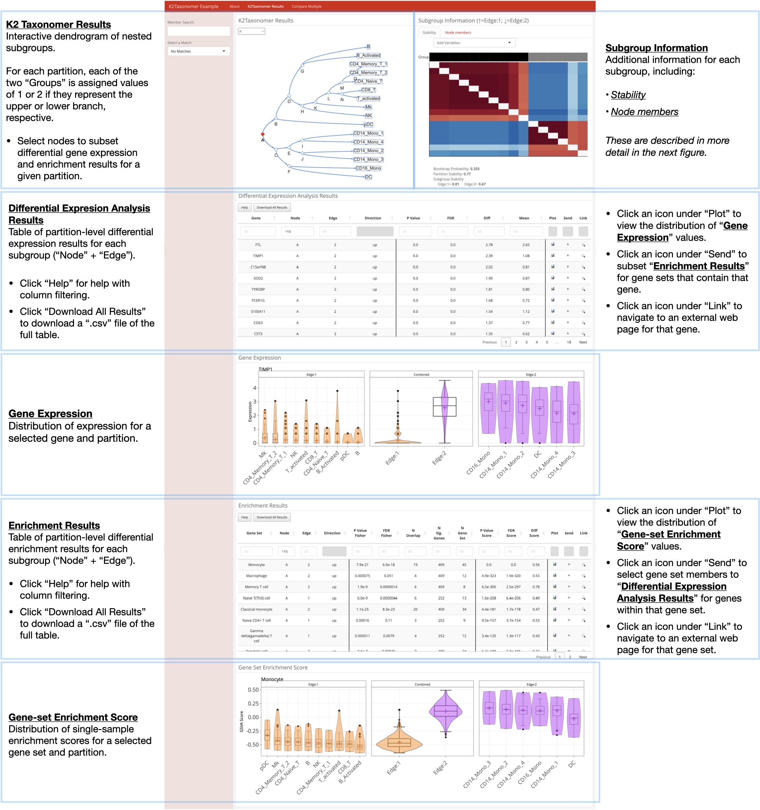

```{r, include=FALSE}
knitr::opts_chunk$set(
    collapse=TRUE,
    comment="#>",
    message=FALSE,
    warning=FALSE,
    eval=FALSE
)
```

# Introduction

To facilitate the comprehensive interrogation the output of
`r Githubpkg("montilab/K2Taxonomer")` this package includes functionality for
generating interactive dashboards, which include full compendia of results
[@reed_2020]. In addition to the partition-level molecular comparisons included
in these dashboards, they include functionality for performing molecular
comparisons of gene expression and gene set enrichment on user-specified sets
of two-or-more subgroups. In this vignette we describe the steps for creating, editing, and navigating interactive
dashoboards from the output of the `r Githubpkg("montilab/K2Taxonomer")`
workflow [@reed_2020]. For a more detailed description for running
`r Githubpkg("montilab/K2Taxonomer")` visit the vignettes describing single-cell and
single-cell workflows
[here](https://montilab.github.io/K2Taxonomer/articles/01_K2Taxonomer_singlecell),
and
[here](https://montilab.github.io/K2Taxonomer/articles/02_K2Taxonomer_bulk),
respectively.

# Requirements

## Load packages

```{r setup}
## K2Taxonomer package
library(K2Taxonomer)

## Seurat package
library(Seurat)

## For drawing dendrograms
library(ggdendro)
```

# Run K2Taxonomer workflow (Single-cell Example)

## Read in single-cell RNAseq data

```{r loadData}
data("ifnb_small")
```

## Read in gene sets for subgroup annotation

```{r loadGeneSets}
data("cellMarker2_genesets")
```

## Get necessary data objects

```{r k2DataAlt}
## Integrated expression matrix used for clustering data
integrated_expression_matrix <- ifnb_small@assays$integrated$scale.data

## Normalized expression matrix to be used for downstream analyses
normalized_expression_matrix <- ifnb_small@assays$SCT$data

## Profile-level information
cell_data <- ifnb_small@meta.data
```

## Run K2Taxonomer workflow

```{r k2_run}
# Initialize `K2` object
K2res <- K2preproc(object = integrated_expression_matrix,
                   eMatDS = normalized_expression_matrix,
                   colData = cell_data,
                   cohorts="cell_type",
                   nBoots = 200,
                   clustFunc = "cKmeansDownsampleSqrt",
                   genesets = cellMarker2_genesets)

# Perform recursive partitioning
K2res <- K2tax(K2res)

# Partition-level differential gene expression
K2res <- runDGEmods(K2res)

### Perform Fisher Exact Test based over-representation analysis
K2res <- runFISHERmods(K2res)

### Perform single-sample gene set scoring
K2res <- runScoreGeneSets(K2res)

### Perform partition-level differential gene set score analysis
K2res <- runDSSEmods(K2res)
```

### Check partitioning results

```{r dendrogram, fig.align='center', fig.width=5, fig.height=4}
## Get dendrogram from K2Taxonomer
dendro <- K2dendro(K2res)

## Plot dendrogram
ggdendrogram(dendro)
```

# Creating a dashboard

We generate the interactive dashboards with the `K2dashboard()` function. This
function will create a directory with two files. These two files include the
interactive *RMarkdown* (.Rmd) file created by the `r CRANpkg("flexdashboard")`
package and the R object (.rds) file containing the `K2` object created by
`r Githubpkg("montilab/K2Taxonomer")` functions.

Below we shown the `K2dashboard()` function and each of its arguments.

The first argument, specifying the `K2` object is the only requirement. The
remaining three arguments costumize the output, as follows:

- **analysis_name**: Specifies the title to be printed on the top of the
dashboard. Also, specifies the prefix of the name of the output files. For
filenames, spaces are replaced by underscores.

- **about**: Logical specifying whether to include an about page in the
dashboard. If TRUE (default), a third file is written to the dashboard
directory, "**about.md**". This is an editable *markdown* (.md) file, which the
user is free to edit, and includes some default information about where to
learn more about `r Githubpkg("montilab/K2Taxonomer")` and how to navigate the
dashboard. Customizing this file is described in more detail below.

- **output_dir**: This is simply the path to the directory to write the
dashboard directory.

```{r dashboard, eval=FALSE}
K2dashboard(K2res,
            analysis_name="K2Taxonomer Example",
            about=TRUE,
            output_dir=".")
```

## Additional considerations

### The output directory

To prevent the overwriting of dashboard files, in addition to the
**analysis_name**, the name of dashboard directory includes the date and time. 
It is formatted as follows:

<center>**analysis_name**_YEAR_MONTH_DAY_HOUR_MINUTE_SECOND.INTEGER</center>

**Note: Changing the name of this directory does not effect the dashboard.**

### The "**about.md**" file

`r Githubpkg("montilab/K2Taxonomer")` allows users to include information about
their study in the interactive dashboards by editing" the "**about.md**"
*markdown* file. When the "**about.md**" is included in the dashboard
directory, it is read in and the *markdown* code is compiled along with the
code in the dashboard file.

This file uses *markdown* syntax specific to the CRANpkg("flexdashboard")
"Multiple Pages" layout, which can be reviewed
[here](https://rmarkdown.rstudio.com/flexdashboard/layouts.html). Mainly, the
first two lines of the default "**about.md**" file.

```
about
=====================================
```


Will result in a tab, named *About*, as the first tab in the dashboard.
Furthermore, lines with headers should start at three hashes, "###".

Finally, when including links in the "**about.md**" file, make sure that
clicking on these links opens a new window using the following:

```
[TEXT](URL){target="_blank"}
```

Otherwise, the dashboard will need to reload upon navigating back.

# Navigating dashboards
`r Githubpkg("montilab/K2Taxonomer")` dashboards comprise three tabs,
described below:

- __**About**__: This optional tab with which the user can include
information about the analysis being performed. This page is populated by a
file, "**about.md**", included in the same directory as the dashboard file.
More information about formatting this file can be found
[here](https://montilab.github.io/K2Taxonomer/articles/K2Taxonomer_dashboard).

- __***K2Taxonomer* Results**__: This tab includes all of the results generated
throughout the `r Githubpkg("montilab/K2Taxonomer")` workflow, including:
*partitioning results*, *partition stability*, *gene expression analysis*,
*gene set enrichment*, and *phenotypic variable testing (optional)*.
More information for how `r Githubpkg("montilab/K2Taxonomer")` estimates these
results can be found
[here](https://montilab.github.io/K2Taxonomer/articles/K2Taxonomer_dashboard).

- __**Compare Multiple**__: This tab allows the user to perform additional
molecular comparisons between subgroups, beyond the partition-level comparisons
performed by `r Githubpkg("montilab/K2Taxonomer")` functions.

Annotation of each of these tabs is presented below. **Click on any of these
images to view in higher resolution**

# __**About**__

***

<a href="https://montilab.github.io/K2Taxonomer/articles/page1.jpeg">
    
</a>

***

# __**`r Githubpkg("montilab/K2Taxonomer")` Results**__

***

<a href="https://montilab.github.io/K2Taxonomer/articles/page2.jpeg">
    
</a>

***

## __*Subgroup Information*__

***

<a href="https://montilab.github.io/K2Taxonomer/articles/page3.jpeg">
    
</a>

***

# __**Compare Multiple**__

***

<a href="https://montilab.github.io/K2Taxonomer/articles/page4.jpeg">
    
</a>

***

# References
